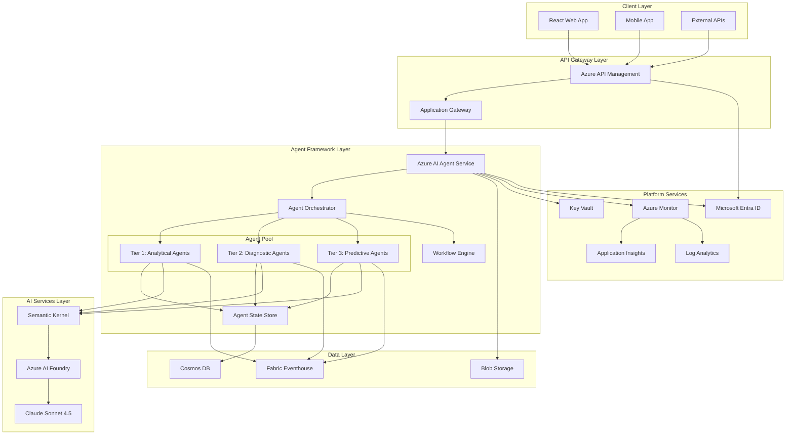

# Production-Grade Migration to Microsoft Agent Framework

## Executive Summary

This document outlines the strategy to transform your current local agent-based application into a production-grade enterprise solution using **Microsoft Agent Framework**. The migration will provide enterprise scalability, advanced orchestration, security/compliance, and operational excellence.

---

## Current Architecture Analysis

### 🏗️ Current State: Local Standalone Solution

**Components:**
1. **Frontend**: React/Vite application (localhost:5173)
2. **Backend**: FastAPI Python server (localhost:8000)
3. **Agents**: 7 specialized Python agents
   - Tier 1 Analytical: Performance Analyst, Data Quality, Line Operations
   - Tier 2 Diagnostic: Downtime RCA, Bottleneck/Constraint
   - Tier 3 Predictive: Operations Recommendation, Executive Briefing
4. **Data Layer**: Microsoft Fabric Eventhouse (Kusto)
5. **AI Provider**: Azure AI Foundry (Claude Sonnet 4.5)

**Current Architecture Pattern:**
```
┌─────────────────┐
│  React Frontend │
│   (Port 5173)   │
└────────┬────────┘
         │ HTTP/REST
         ▼
┌─────────────────┐
│  FastAPI Backend│
│   (Port 8000)   │
└────────┬────────┘
         │
    ┌────┴────┐
    ▼         ▼
┌─────────┐ ┌──────────────┐
│ Agents  │ │   Fabric     │
│ (Local) │ │ Eventhouse   │
└────┬────┘ └──────────────┘
     │
     ▼
┌──────────────┐
│ Azure AI     │
│ Foundry      │
│ (Claude)     │
└──────────────┘
```

**Limitations:**
- ❌ Single-tenant, local deployment only
- ❌ No agent orchestration or workflow management
- ❌ Limited scalability (single server)
- ❌ Manual deployment and updates
- ❌ Basic error handling and retry logic
- ❌ No distributed tracing or observability
- ❌ Limited security controls
- ❌ No multi-region support

---

## Microsoft Agent Framework Overview

### 🎯 What is Microsoft Agent Framework?

Microsoft Agent Framework is an **enterprise-grade platform** for building, deploying, and managing AI agents at scale. It provides:

**Core Capabilities:**
1. **Agent Runtime**: Managed execution environment for agents
2. **Orchestration Engine**: Multi-agent coordination and workflows
3. **State Management**: Distributed state across agent conversations
4. **Security & Compliance**: Enterprise-grade security, RBAC, audit logs
5. **Scalability**: Auto-scaling, load balancing, multi-region
6. **Observability**: Built-in monitoring, tracing, and analytics
7. **Integration Hub**: Pre-built connectors to Azure services

**Key Services:**
- **Azure AI Agent Service**: Managed agent hosting and execution
- **Azure AI Foundry**: Model deployment and management (already using!)
- **Azure OpenAI/Anthropic**: LLM providers (already using Claude!)
- **Semantic Kernel**: Agent framework and orchestration
- **Prompt Flow**: Visual workflow designer for agent chains
- **Azure API Management**: API gateway for agent endpoints
- **Azure Monitor**: Observability and analytics

---

## Production-Grade Architecture Design

### 🏛️ Target Architecture: Microsoft Agent Framework



### 🔑 Key Architectural Components

#### 1. **API Gateway Layer**
- **Azure API Management (APIM)**
  - Centralized API gateway for all agent endpoints
  - Rate limiting, throttling, and quota management
  - API versioning and lifecycle management
  - Developer portal for API documentation
  - OAuth 2.0 / JWT authentication
  - Request/response transformation

- **Application Gateway**
  - Layer 7 load balancing
  - Web Application Firewall (WAF)
  - SSL/TLS termination
  - Multi-region routing

#### 2. **Agent Framework Layer**
- **Azure AI Agent Service**
  - Managed hosting for agent containers
  - Auto-scaling based on demand
  - Health monitoring and auto-recovery
  - Blue-green deployments
  - A/B testing capabilities

- **Agent Orchestrator**
  - Multi-agent coordination
  - Workflow execution engine
  - Event-driven agent triggers
  - Agent-to-agent communication
  - Parallel and sequential execution

- **Agent State Store**
  - Distributed conversation state
  - Session management
  - Context persistence across interactions
  - Multi-turn conversation support

#### 3. **AI Services Layer**
- **Semantic Kernel Integration**
  - Agent framework and planner
  - Plugin architecture for extensibility
  - Memory and context management
  - Function calling and tool use
  - Prompt engineering and templates

- **Azure AI Foundry** (Already Using!)
  - Model deployment and versioning
  - A/B testing for model variants
  - Performance monitoring
  - Cost optimization

#### 4. **Data Layer**
- **Microsoft Fabric Eventhouse** (Already Using!)
  - Real-time analytics and KQL queries
  - Production data source

- **Azure Cosmos DB**
  - Agent state and conversation history
  - Global distribution
  - Multi-region writes
  - Low-latency access

- **Azure Blob Storage**
  - Document storage for agents
  - Audit logs and compliance data
  - Large file handling

#### 5. **Platform Services**
- **Azure Key Vault**
  - Secrets management (API keys, connection strings)
  - Certificate management
  - Encryption key management

- **Azure Monitor + Application Insights**
  - Distributed tracing across agents
  - Performance metrics and dashboards
  - Custom alerts and notifications
  - Log aggregation and analysis

- **Microsoft Entra ID**
  - Identity and access management
  - Role-based access control (RBAC)
  - Multi-factor authentication (MFA)
  - Conditional access policies

---

## Agent Migration Strategy

### 📋 Agent Mapping: Current → Agent Framework

| Current Agent | Agent Framework Pattern | Key Changes |
|--------------|------------------------|-------------|
| **Performance Analyst** | Analytical Agent with Semantic Kernel | Add memory, multi-turn conversations, tool plugins |
| **Data Quality** | Monitoring Agent with scheduled triggers | Add proactive monitoring, alerting, auto-remediation |
| **Line Operations** | Real-time Agent with event triggers | Add event-driven execution, streaming data support |
| **Downtime RCA** | Diagnostic Agent with workflow orchestration | Add multi-step investigation, evidence collection |
| **Bottleneck/Constraint** | Optimization Agent with planning capabilities | Add constraint solver, optimization algorithms |
| **Operations Recommendation** | Decision Agent with approval workflows | Add human-in-the-loop, recommendation tracking |
| **Executive Briefing** | Reporting Agent with scheduled generation | Add templating, multi-format output, distribution |

### 🔄 Migration Approach: Phased Rollout

#### **Phase 1: Foundation (Weeks 1-4)**
- Set up Azure AI Agent Service environment
- Configure Azure API Management
- Migrate authentication to Microsoft Entra ID
- Set up monitoring and observability
- Deploy Cosmos DB for state management

#### **Phase 2: Agent Migration (Weeks 5-8)**
- Convert agents to Semantic Kernel plugins
- Implement agent orchestration patterns
- Add state management and memory
- Deploy Tier 1 agents (Analytical)
- Parallel run with existing system

#### **Phase 3: Advanced Features (Weeks 9-12)**
- Deploy Tier 2 agents (Diagnostic)
- Deploy Tier 3 agents (Predictive)
- Implement multi-agent workflows
- Add event-driven triggers
- Implement approval workflows

#### **Phase 4: Production Hardening (Weeks 13-16)**
- Load testing and performance optimization
- Security hardening and penetration testing
- Disaster recovery and backup procedures
- Documentation and runbooks
- Training and knowledge transfer

#### **Phase 5: Cutover (Week 17+)**
- Blue-green deployment
- Gradual traffic migration
- Monitoring and validation
- Decommission old system

---

## Technical Implementation Details

### 🛠️ Agent Framework Implementation

#### **1. Semantic Kernel Agent Structure**

```python
# Example: Performance Analyst Agent with Semantic Kernel

from semantic_kernel import Kernel
from semantic_kernel.connectors.ai.anthropic import AnthropicChatCompletion
from semantic_kernel.functions import kernel_function
from semantic_kernel.memory import SemanticTextMemory
from azure.cosmos import CosmosClient

class PerformanceAnalystAgent:
    def __init__(self):
        # Initialize Semantic Kernel
        self.kernel = Kernel()
        
        # Add AI service (Claude via Azure AI Foundry)
        self.kernel.add_service(
            AnthropicChatCompletion(
                service_id="claude",
                api_key=os.getenv("ANTHROPIC_API_KEY"),
                base_url=os.getenv("ANTHROPIC_BASE_URL")
            )
        )
        
        # Add memory for conversation context
        self.memory = SemanticTextMemory()
        
        # Add state store (Cosmos DB)
        self.state_store = CosmosClient(
            url=os.getenv("COSMOS_ENDPOINT"),
            credential=os.getenv("COSMOS_KEY")
        )
        
        # Register plugins
        self.register_plugins()
    
    def register_plugins(self):
        """Register agent capabilities as plugins"""
        
        @kernel_function(
            name="analyze_oee",
            description="Analyze Overall Equipment Effectiveness metrics"
        )
        async def analyze_oee(context):
            # Query Eventhouse for OEE data
            oee_data = await self.query_eventhouse(
                "ProductionMetrics | where MetricType == 'OEE'"
            )
            return self.analyze_metrics(oee_data)
        
        @kernel_function(
            name="compare_lines",
            description="Compare performance across production lines"
        )
        async def compare_lines(context):
            # Multi-line analysis
            pass
        
        # Add plugins to kernel
        self.kernel.add_plugin(
            plugin_name="performance_analysis",
            functions=[analyze_oee, compare_lines]
        )
    
    async def execute(self, user_query: str, session_id: str):
        """Execute agent with orchestration"""
        
        # Load conversation state
        state = await self.load_state(session_id)
        
        # Create planner for multi-step execution
        planner = SequentialPlanner(self.kernel)
        plan = await planner.create_plan(user_query)
        
        # Execute plan
        result = await plan.invoke(self.kernel)
        
        # Save state
        await self.save_state(session_id, result)
        
        return result
```

#### **2. Agent Orchestration with Workflows**

```python
# Example: Multi-Agent Workflow for Production Issue Investigation

from azure.ai.agent import AgentOrchestrator, Workflow

class ProductionIssueWorkflow(Workflow):
    def __init__(self):
        self.orchestrator = AgentOrchestrator()
        
        # Register agents
        self.performance_agent = PerformanceAnalystAgent()
        self.data_quality_agent = DataQualityAgent()
        self.downtime_agent = DowntimeRCAAgent()
        self.recommendation_agent = OperationsRecommendationAgent()
    
    async def investigate_issue(self, issue_description: str):
        """Multi-agent workflow for issue investigation"""
        
        # Step 1: Data Quality Check
        quality_result = await self.orchestrator.execute(
            agent=self.data_quality_agent,
            task="Verify data quality for the reported issue",
            context={"issue": issue_description}
        )
        
        if not quality_result.data_is_valid:
            return {"status": "data_quality_issue", "details": quality_result}
        
        # Step 2: Performance Analysis (Parallel)
        performance_task = self.orchestrator.execute(
            agent=self.performance_agent,
            task="Analyze performance metrics related to the issue"
        )
        
        downtime_task = self.orchestrator.execute(
            agent=self.downtime_agent,
            task="Investigate root cause of downtime"
        )
        
        # Wait for parallel execution
        performance_result, downtime_result = await asyncio.gather(
            performance_task, downtime_task
        )
        
        # Step 3: Generate Recommendations
        recommendation_result = await self.orchestrator.execute(
            agent=self.recommendation_agent,
            task="Generate actionable recommendations",
            context={
                "performance": performance_result,
                "root_cause": downtime_result
            }
        )
        
        # Step 4: Human Approval (if needed)
        if recommendation_result.requires_approval:
            await self.request_approval(recommendation_result)
        
        return {
            "status": "complete",
            "analysis": {
                "performance": performance_result,
                "root_cause": downtime_result,
                "recommendations": recommendation_result
            }
        }
```

#### **3. Event-Driven Agent Triggers**

```python
# Example: Event-driven agent execution

from azure.eventgrid import EventGridPublisherClient
from azure.functions import EventGridEvent

class EventDrivenAgentTrigger:
    def __init__(self):
        self.event_client = EventGridPublisherClient(
            endpoint=os.getenv("EVENTGRID_ENDPOINT"),
            credential=DefaultAzureCredential()
        )
    
    async def on_production_anomaly(self, event: EventGridEvent):
        """Trigger agents when production anomaly detected"""
        
        anomaly_data = event.data
        
        # Trigger Line Operations Agent for immediate response
        await self.trigger_agent(
            agent_type="line_operations",
            priority="high",
            data=anomaly_data
        )
        
        # Trigger Data Quality Agent to verify data
        await self.trigger_agent(
            agent_type="data_quality",
            priority="medium",
            data=anomaly_data
        )
    
    async def on_scheduled_report(self, timer: str):
        """Trigger Executive Briefing Agent on schedule"""
        
        await self.trigger_agent(
            agent_type="executive_briefing",
            priority="low",
            schedule="daily_8am"
        )
```

---

## Security & Compliance Architecture

### 🔒 Enterprise Security Controls

#### **1. Identity & Access Management**
- **Microsoft Entra ID Integration**
  - Single Sign-On (SSO) for all users
  - Multi-Factor Authentication (MFA) required
  - Conditional Access policies based on risk
  - Privileged Identity Management (PIM) for admin access

- **Role-Based Access Control (RBAC)**
  ```
  Roles:
  - Production Manager: Full access to all agents
  - Shift Supervisor: Access to Tier 1 & 2 agents
  - Operator: Read-only access to dashboards
  - Data Analyst: Access to Data Quality agent only
  - Executive: Access to Executive Briefing agent only
  ```

#### **2. Data Security**
- **Encryption at Rest**
  - All data encrypted using Azure Storage Service Encryption
  - Customer-managed keys in Azure Key Vault
  - Transparent Data Encryption (TDE) for Cosmos DB

- **Encryption in Transit**
  - TLS 1.3 for all communications
  - Certificate pinning for agent-to-agent communication
  - VNet integration for private connectivity

- **Data Isolation**
  - Multi-tenant data isolation using Cosmos DB partition keys
  - Separate containers per customer/plant
  - Row-level security in Eventhouse

#### **3. Secrets Management**
- **Azure Key Vault**
  - All API keys, connection strings, certificates stored in Key Vault
  - Managed identities for service-to-service authentication
  - Automatic secret rotation
  - Audit logging for all secret access

#### **4. Network Security**
- **Private Endpoints**
  - All Azure services accessed via private endpoints
  - No public internet exposure
  - VNet integration for agent services

- **Web Application Firewall (WAF)**
  - OWASP Top 10 protection
  - DDoS protection
  - Rate limiting and bot detection

#### **5. Compliance & Audit**
- **Audit Logging**
  - All agent interactions logged to Log Analytics
  - Immutable audit trail in Blob Storage
  - Compliance with SOC 2, ISO 27001, GDPR

- **Data Residency**
  - Multi-region deployment with data residency controls
  - Data sovereignty compliance
  - Right to be forgotten (GDPR)

---

## Scalability & Performance

### 📈 Auto-Scaling Strategy

#### **1. Agent Service Scaling**
```yaml
# Azure Container Apps scaling configuration
scale:
  minReplicas: 2
  maxReplicas: 50
  rules:
    - name: http-scaling
      http:
        metadata:
          concurrentRequests: 100
    - name: cpu-scaling
      custom:
        type: cpu
        metadata:
          type: Utilization
          value: "70"
    - name: memory-scaling
      custom:
        type: memory
        metadata:
          type: Utilization
          value: "80"
```

#### **2. Performance Targets**
- **Response Time**: < 2 seconds for 95th percentile
- **Throughput**: 1000+ requests/second per agent
- **Availability**: 99.9% uptime SLA
- **Concurrent Users**: 10,000+ simultaneous users

#### **3. Caching Strategy**
- **Redis Cache** for frequently accessed data
- **CDN** for static frontend assets
- **Agent response caching** for common queries
- **Eventhouse query result caching**

#### **4. Load Balancing**
- **Geographic load balancing** across regions
- **Agent pool load balancing** for even distribution
- **Intelligent routing** based on agent specialization

---

## Observability & Monitoring

### 📊 Monitoring Architecture

#### **1. Application Insights**
```python
# Distributed tracing across agents

from opencensus.ext.azure.trace_exporter import AzureExporter
from opencensus.trace.tracer import Tracer

tracer = Tracer(
    exporter=AzureExporter(
        connection_string=os.getenv("APPINSIGHTS_CONNECTION_STRING")
    )
)

@tracer.span(name="agent_execution")
async def execute_agent(agent_type: str, query: str):
    with tracer.span(name=f"{agent_type}_processing"):
        # Agent execution
        result = await agent.execute(query)
    
    # Log metrics
    tracer.add_attribute("agent_type", agent_type)
    tracer.add_attribute("execution_time_ms", execution_time)
    tracer.add_attribute("tokens_used", result.tokens)
    
    return result
```

#### **2. Key Metrics Dashboard**
- **Agent Performance**
  - Response time per agent
  - Success/failure rate
  - Token usage and cost
  - Concurrent executions

- **System Health**
  - CPU/Memory utilization
  - Request queue depth
  - Error rates and types
  - API throttling events

- **Business Metrics**
  - Agent usage by type
  - User engagement
  - Cost per interaction
  - ROI metrics

#### **3. Alerting Strategy**
```yaml
# Example alert rules
alerts:
  - name: high_error_rate
    condition: error_rate > 5%
    severity: critical
    action: page_on_call_engineer
  
  - name: slow_response_time
    condition: p95_response_time > 5s
    severity: warning
    action: notify_team
  
  - name: high_cost
    condition: daily_cost > $1000
    severity: warning
    action: notify_finance_team
```

---

## Cost Analysis & Optimization

### 💰 Cost Breakdown (Estimated Monthly)

#### **Azure Services**
| Service | Configuration | Est. Monthly Cost |
|---------|--------------|-------------------|
| Azure AI Agent Service | 10 agent instances, auto-scaling | $2,000 - $5,000 |
| Azure AI Foundry (Claude) | 10M tokens/month | $3,000 - $8,000 |
| Azure API Management | Premium tier | $2,800 |
| Cosmos DB | 10,000 RU/s, multi-region | $1,500 - $3,000 |
| Application Insights | 100 GB/month | $230 |
| Azure Monitor | Log Analytics 50 GB/month | $115 |
| Key Vault | 10,000 operations/month | $5 |
| Blob Storage | 1 TB, hot tier | $20 |
| Eventhouse | Already provisioned | $0 (existing) |
| **Total Estimated** | | **$9,670 - $19,170/month** |

#### **Cost Optimization Strategies**

1. **Reserved Instances**
   - 1-year or 3-year commitments for 30-40% savings
   - Apply to Cosmos DB, API Management, compute

2. **Auto-Scaling Policies**
   - Scale down during off-hours
   - Use spot instances for non-critical workloads
   - Implement aggressive caching

3. **Token Optimization**
   - Prompt engineering to reduce token usage
   - Response caching for common queries
   - Use smaller models for simple tasks

4. **Data Lifecycle Management**
   - Archive old logs to cool/archive storage
   - Implement data retention policies
   - Compress audit logs

5. **Multi-Tenancy**
   - Share infrastructure across multiple plants
   - Implement usage-based chargeback

**Estimated Optimized Cost: $6,000 - $12,000/month**

---

## Deployment & DevOps

### 🚀 CI/CD Pipeline

#### **1. Infrastructure as Code (IaC)**
```yaml
# Azure Bicep template for agent infrastructure

resource agentService 'Microsoft.App/containerApps@2023-05-01' = {
  name: 'production-agent-service'
  location: location
  properties: {
    configuration: {
      ingress: {
        external: true
        targetPort: 8000
      }
      secrets: [
        {
          name: 'anthropic-api-key'
          keyVaultUrl: keyVault.properties.vaultUri
        }
      ]
    }
    template: {
      containers: [
        {
          name: 'agent-container'
          image: 'acr.azurecr.io/agents:latest'
          resources: {
            cpu: 2
            memory: '4Gi'
          }
        }
      ]
      scale: {
        minReplicas: 2
        maxReplicas: 50
      }
    }
  }
}
```

#### **2. GitHub Actions Workflow**
```yaml
# .github/workflows/deploy-agents.yml

name: Deploy Agents to Production

on:
  push:
    branches: [main]
  workflow_dispatch:

jobs:
  build-and-deploy:
    runs-on: ubuntu-latest
    steps:
      - uses: actions/checkout@v3
      
      - name: Build agent containers
        run: |
          docker build -t agents:${{ github.sha }} .
          docker tag agents:${{ github.sha }} acr.azurecr.io/agents:latest
      
      - name: Run security scan
        run: |
          trivy image agents:${{ github.sha }}
      
      - name: Push to ACR
        run: |
          az acr login --name acr
          docker push acr.azurecr.io/agents:latest
      
      - name: Deploy to staging
        run: |
          az containerapp update \
            --name agent-service-staging \
            --image acr.azurecr.io/agents:latest
      
      - name: Run integration tests
        run: |
          pytest tests/integration/
      
      - name: Deploy to production (blue-green)
        run: |
          az containerapp revision copy \
            --name agent-service-prod \
            --image acr.azurecr.io/agents:latest
          
          # Gradual traffic shift
          az containerapp ingress traffic set \
            --name agent-service-prod \
            --revision-weight latest=10 previous=90
      
      - name: Monitor deployment
        run: |
          # Wait and monitor metrics
          sleep 300
          
          # Check error rates
          if [ $(az monitor metrics list --resource agent-service-prod --metric ErrorRate) -lt 1 ]; then
            # Full cutover
            az containerapp ingress traffic set \
              --name agent-service-prod \
              --revision-weight latest=100
          else
            # Rollback
            az containerapp revision deactivate --revision latest
          fi
```

#### **3. Deployment Environments**
- **Development**: Local development with Docker Compose
- **Staging**: Azure environment mirroring production
- **Production**: Multi-region deployment with blue-green

---

## Migration Roadmap

### 📅 Detailed Implementation Timeline

#### **Phase 1: Foundation (Weeks 1-4)**

**Week 1: Azure Environment Setup**
- [ ] Provision Azure AI Agent Service
- [ ] Set up Azure API Management
- [ ] Configure Microsoft Entra ID
- [ ] Create resource groups and networking
- [ ] Set up Key Vault and secrets

**Week 2: Data Layer Migration**
- [ ] Provision Cosmos DB for state management
- [ ] Set up Blob Storage for audit logs
- [ ] Configure Eventhouse connectivity
- [ ] Implement data migration scripts
- [ ] Test data access patterns

**Week 3: Monitoring & Security**
- [ ] Configure Application Insights
- [ ] Set up Log Analytics workspace
- [ ] Implement distributed tracing
- [ ] Configure alerts and dashboards
- [ ] Security hardening and penetration testing

**Week 4: CI/CD Pipeline**
- [ ] Set up GitHub Actions workflows
- [ ] Create Bicep/Terraform templates
- [ ] Implement blue-green deployment
- [ ] Configure staging environment
- [ ] Test deployment automation

#### **Phase 2: Agent Migration (Weeks 5-8)**

**Week 5: Semantic Kernel Integration**
- [ ] Convert agents to Semantic Kernel plugins
- [ ] Implement memory and state management
- [ ] Add function calling capabilities
- [ ] Create agent base classes
- [ ] Unit testing for agent logic

**Week 6: Tier 1 Agent Deployment**
- [ ] Deploy Performance Analyst Agent
- [ ] Deploy Data Quality Agent
- [ ] Deploy Line Operations Agent
- [ ] Integration testing
- [ ] Parallel run with existing system

**Week 7: Agent Orchestration**
- [ ] Implement orchestration engine
- [ ] Create multi-agent workflows
- [ ] Add event-driven triggers
- [ ] Test agent-to-agent communication
- [ ] Performance optimization

**Week 8: Frontend Integration**
- [ ] Update frontend to use new API endpoints
- [ ] Implement authentication flow
- [ ] Add error handling and retry logic
- [ ] User acceptance testing
- [ ] Documentation updates

#### **Phase 3: Advanced Features (Weeks 9-12)**

**Week 9: Tier 2 Agent Deployment**
- [ ] Deploy Downtime RCA Agent
- [ ] Deploy Bottleneck/Constraint Agent
- [ ] Implement diagnostic workflows
- [ ] Integration testing
- [ ] Performance tuning

**Week 10: Tier 3 Agent Deployment**
- [ ] Deploy Operations Recommendation Agent
- [ ] Deploy Executive Briefing Agent
- [ ] Implement approval workflows
- [ ] Scheduled report generation
- [ ] End-to-end testing

**Week 11: Multi-Tenant Support**
- [ ] Implement tenant isolation
- [ ] Configure data partitioning
- [ ] Set up RBAC policies
- [ ] Test multi-tenant scenarios
- [ ] Security audit

**Week 12: Advanced Orchestration**
- [ ] Implement complex workflows
- [ ] Add human-in-the-loop approvals
- [ ] Create workflow templates
- [ ] Performance optimization
- [ ] Load testing

#### **Phase 4: Production Hardening (Weeks 13-16)**

**Week 13: Performance Testing**
- [ ] Load testing (1000+ req/s)
- [ ] Stress testing
- [ ] Scalability testing
- [ ] Identify bottlenecks
- [ ] Optimization and tuning

**Week 14: Security Hardening**
- [ ] Penetration testing
- [ ] Vulnerability scanning
- [ ] Security audit
- [ ] Compliance validation
- [ ] Remediation of findings

**Week 15: Disaster Recovery**
- [ ] Implement backup procedures
- [ ] Test failover scenarios
- [ ] Create runbooks
- [ ] Document recovery procedures
- [ ] DR drill

**Week 16: Training & Documentation**
- [ ] Create user documentation
- [ ] Develop training materials
- [ ] Conduct training sessions
- [ ] Create operational runbooks
- [ ] Knowledge transfer

#### **Phase 5: Cutover (Week 17+)**

**Week 17: Pre-Production Validation**
- [ ] Final integration testing
- [ ] User acceptance testing
- [ ] Performance validation
- [ ] Security sign-off
- [ ] Go/no-go decision

**Week 18: Blue-Green Deployment**
- [ ] Deploy to production (blue environment)
- [ ] Gradual traffic migration (10% → 50% → 100%)
- [ ] Monitor metrics and errors
- [ ] Rollback plan ready
- [ ] 24/7 monitoring

**Week 19: Stabilization**
- [ ] Monitor production metrics
- [ ] Address any issues
- [ ] Fine-tune performance
- [ ] Collect user feedback
- [ ] Optimization

**Week 20: Decommission Old System**
- [ ] Archive old system data
- [ ] Decommission